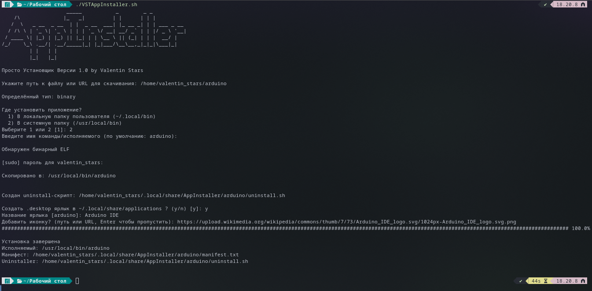

# Universal Installer

**Просто Установщик Версии 1.0 by Valentin Stars**  

Скрипт предназначен для удобной установки приложений (AppImage, shell-скриптов, бинарных файлов) из локального пути или по URL.  
Он автоматически определяет тип файла, устанавливает его в выбранную директорию, создает ярлыки, а также формирует uninstall-скрипт.  

---

## Возможности
- Определение типа файла: `AppImage`, `shell-скрипт`, `ELF-бинарник`
- Установка в:
  - `~/.local/bin` (пользовательский режим)
  - `/usr/local/bin` (системный режим)
- Создание резервных копий при повторной установке
- Автоматическая генерация `uninstall.sh`
- Поддержка `.desktop` ярлыков и иконок
- Логирование информации о каждой установке (манифест)

---

## Использование

```bash
git clone https://github.com/username/AppInstaller.git
cd AppInstaller
chmod +x VSTAppInstaller.sh
./VSTAppInstaller.sh
```

После запуска скрипт запросит:
1. **Путь или URL** до файла (например, AppImage или `.sh`)  
2. **Куда установить** — в `~/.local/bin` или `/usr/local/bin`  
3. **Имя команды** (по умолчанию совпадает с именем файла)  
4. Нужно ли создать `.desktop` ярлык и добавить иконку  

---

## Скриншот работы



---

## Структура проекта

```
.
├── VSTAppInstaller.sh         # основной скрипт
├── assets/
│   └── screenshot.png   # скриншот работы
└── README.md
```

---

## Удаление программы

Для каждой установки создается собственный uninstall-скрипт.  
Он находится в:

```
~/.local/share/AppInstaller/<appname>/uninstall.sh
```

Запустите его для удаления установленного приложения:

```bash
~/.local/share/AppInstaller/<appname>/uninstall.sh
```

---

## Требования
- `curl` или `wget`
- `file`, `strings` 
